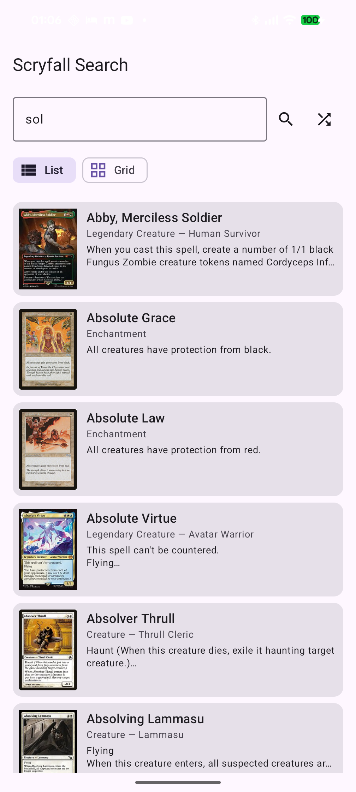

<div align="center">
  <h1>🃏 Scryfall API</h1>
  <p><strong>Kotlin Multiplatform library for the Scryfall Magic: The Gathering API</strong></p>

  
  
  

  
  
  
  
</div>

---

A comprehensive Kotlin Multiplatform library providing type-safe access to the [Scryfall REST API](https://scryfall.com/docs/api), the premier Magic: The Gathering card database.

## Features

- **🎯 Fully Typed API** - Complete Kotlin models for all Scryfall data structures
- **🔄 Multiplatform Support** - Works on JVM, Android, iOS, JavaScript (Node.js & Browser)
- **🚀 Coroutine-First** - All API calls are suspend functions
- **🔨 Type-Safe Query DSL** - Build search queries with IDE autocomplete instead of raw strings
- **🃏 Card Extension Functions** - Rich set of utilities for filtering, sorting, and checking card properties
- **✅ Input Validation** - Client-side validation with clear error messages catches issues before API calls
- **⚡ Rate Limit Aware** - Handles 429 responses with Retry-After headers
- **🛡️ Type-Safe Errors** - Sealed exception hierarchy for robust error handling
- **📝 Configurable Logging** - Built-in HTTP request/response logging for debugging
- **🧪 Well Tested** - Comprehensive unit and integration tests
- **📚 Fully Documented** - KDoc comments with links to official API docs

## Supported Platforms

This library works on all major Kotlin Multiplatform targets:

- **JVM** - Desktop applications and server-side
- **Android** - Native Android apps (minSdk 24)
- **iOS** - Native iOS apps (x64, arm64, simulator arm64)
- **JavaScript** - Browser and Node.js environments

All features work consistently across all platforms with appropriate HTTP client engines configured for each target.

## Supported APIs

| API | Description | Endpoints |
|-----|-------------|-----------|
| **Cards** | Search and retrieve card data | 13 methods including search, named lookup, random, and ID-based queries |
| **Sets** | Magic set information | Query by code, TCGPlayer ID, or Scryfall UUID |
| **Rulings** | Official card rulings | Retrieve rulings by various card identifiers |
| **Catalogs** | Reference data | 20 catalogs including card names, types, keywords, and abilities |
| **Symbology** | Mana symbols and parsing | List symbols and parse mana cost strings |
| **Bulk Data** | Bulk download metadata | Access bulk data exports for offline use |

## Installation

Add to your `build.gradle.kts`:

```kotlin
kotlin {
    sourceSets {
        commonMain.dependencies {
            implementation(project(":scryfall-api"))
        }
    }
}
```

## Quick Start

```kotlin
import devmugi.mtgcards.scryfall.Scryfall

// Create client
val scryfall = Scryfall()

// Search for cards
val results = scryfall.cards.search(q = "Lightning Bolt")
println("Found ${results.totalCards} cards")
results.data.forEach { card ->
    println("${card.name} - ${card.setName}")
}

// Get specific card
val card = scryfall.cards.namedExact("Black Lotus")
println("${card.name} costs ${card.manaCost ?: "nothing!"}")

// Get random card
val random = scryfall.cards.random()
println("Random card: ${random.name}")
```

## Screenshots

<p align="center">
  
  
  
</p>

> See the [samples](samples/) directory for complete working examples on Android, iOS, Web, and Node.js.

## API Usage Examples

### Cards API

The Cards API provides 13 different methods for searching and retrieving cards:

#### Full-Text Search

```kotlin
// Search with Scryfall syntax
val results = scryfall.cards.search(
    q = "t:creature c:red pow>=4",
    unique = UniqueModes.CARDS,
    order = SortingCards.NAME,
    dir = SortDirection.ASC
)

// Paginate through results
if (results.hasMore) {
    val nextPage = results.loadNextPage(scryfall.cards.client)
}

// Or use Flow for automatic pagination
results.asFlow(scryfall.cards.client).collect { card ->
    println(card.name)
}
```

#### Named Lookup

```kotlin
// Exact name match
val bolt = scryfall.cards.namedExact("Lightning Bolt")

// Fuzzy name match
val card = scryfall.cards.namedFuzzy("Jace, the Mind Sculptor")

// Specify set for specific printing
val alphaLotus = scryfall.cards.namedExact(
    name = "Black Lotus",
    set = "lea"
)
```

#### ID-Based Lookup

```kotlin
// By Scryfall ID
val card1 = scryfall.cards.byScryfallId("f2eb06e-...")

// By Multiverse ID
val card2 = scryfall.cards.byMultiverseId(1234)

// By MTG Arena ID
val card3 = scryfall.cards.byArenaId(67890)

// By MTGO ID
val card4 = scryfall.cards.byMtgoId(54321)

// By TCGPlayer ID
val card5 = scryfall.cards.byTcgplayerId(123456)

// By set code and collector number
val card6 = scryfall.cards.bySetAndCollectorNumber(
    code = "khm",
    number = "1"
)
```

#### Batch Lookup (Collection)

```kotlin
val identifiers = listOf(
    Identifier.ScryfallId("f2eb06e-..."),
    Identifier.MultiverseId(1234),
    Identifier.NameAndSet(name = "Lightning Bolt", set = "lea")
)

val collection = scryfall.cards.collection(identifiers)
println("Found ${collection.data.size} cards")

// Check for cards not found
collection.notFound?.forEach { notFound ->
    println("Not found: ${notFound.identifier}")
}
```

#### Autocomplete

```kotlin
val suggestions = scryfall.cards.autocomplete("lig")
suggestions.data.forEach { suggestion ->
    println(suggestion) // "Lightning Bolt", "Light Up the Stage", etc.
}
```

#### Random Card

```kotlin
// Completely random card
val random = scryfall.cards.random()

// Random card matching query
val randomCreature = scryfall.cards.random(q = "t:creature")
```

### Sets API

```kotlin
// Get all sets
val allSets = scryfall.sets.all()
allSets.data.forEach { set ->
    println("${set.name} (${set.code}) - ${set.cardCount} cards")
}

// Get specific set by code
val khm = scryfall.sets.byCode("khm")
println("${khm.name} released on ${khm.released_at}")

// Get set by TCGPlayer ID
val set = scryfall.sets.byTcgPlayerId(12345)

// Get set by Scryfall ID
val set2 = scryfall.sets.byId("uuid-here")
```

### Rulings API

```kotlin
// Get rulings by Scryfall card ID
val rulings = scryfall.rulings.byCardId("f2eb06e-...")
rulings.data.forEach { ruling ->
    println("${ruling.publishedAt}: ${ruling.comment}")
}

// Get rulings by Multiverse ID
val rulings2 = scryfall.rulings.byMultiverseId(1234)

// Get rulings by set and collector number
val rulings3 = scryfall.rulings.byCollectorId(
    code = "khm",
    number = "1"
)
```

### Catalogs API

Access curated reference data:

```kotlin
// Get all card names
val cardNames = scryfall.catalogs.cardNames()
println("Total cards: ${cardNames.data.size}")

// Get creature types
val creatureTypes = scryfall.catalogs.creatureTypes()
creatureTypes.data.forEach { type ->
    println(type) // "Human", "Wizard", "Cat", etc.
}

// Get keyword abilities
val keywords = scryfall.catalogs.keywordAbilities()
println(keywords.data.joinToString()) // "Flying", "Trample", "Haste", etc.

// Other catalogs available:
// - artistNames(), wordBank()
// - supertypes(), cardTypes()
// - planeswalkerTypes(), landTypes(), artifactTypes(), battleTypes(), enchantmentTypes(), spellTypes()
// - powers(), toughnesses(), loyalties()
// - watermarks()
// - keywordActions(), abilityWords(), flavorWords()
```

### Symbology API

```kotlin
// Get all mana symbols
val symbols = scryfall.symbology.all()
symbols.data.forEach { symbol ->
    println("${symbol.symbol}: ${symbol.englishDescription}")
}

// Parse mana cost
val parsed = scryfall.symbology.parseMana("{2}{U}{U}")
println("CMC: ${parsed.manaValue}")
println("Colors: ${parsed.colors.joinToString()}")
```

### Bulk Data API

```kotlin
// Get all bulk data exports
val bulkData = scryfall.bulk.all()
bulkData.data.forEach { item ->
    println("${item.name}: ${item.downloadUri}")
}

// Get specific bulk data by type
val oracleCards = scryfall.bulk.byType("oracle_cards")
println("Download: ${oracleCards.downloadUri}")
println("Size: ${oracleCards.size} bytes")
println("Updated: ${oracleCards.updatedAt}")

// Get bulk data by ID
val bulkItem = scryfall.bulk.byId("uuid-here")
```

## Configuration

Customize the HTTP client behavior:

```kotlin
val scryfall = Scryfall(
    config = ScryfallConfig(
        baseUrl = "https://api.scryfall.com",
        userAgent = "MyApp/1.0 (+https://myapp.com; contact@myapp.com)",
        connectTimeoutMillis = 10_000,
        requestTimeoutMillis = 15_000,
        socketTimeoutMillis = 30_000,
        maxRetries = 2,
        enableLogging = false,
        logLevel = LogLevel.INFO
    )
)
```

### Enable Logging

Enable HTTP request/response logging for debugging:

```kotlin
import io.ktor.client.plugins.logging.*

// With default logger (prints to stdout)
val scryfall = Scryfall(
    config = ScryfallConfig(
        enableLogging = true,
        logLevel = LogLevel.INFO  // or LogLevel.ALL, LogLevel.HEADERS, LogLevel.BODY
    )
)

// With custom logger
val scryfall = Scryfall(
    config = ScryfallConfig(
        enableLogging = true,
        logLevel = LogLevel.BODY
    ),
    logger = { message ->
        // Custom logging implementation
        println("[Scryfall] $message")
        // or use your logging framework
        // myLogger.debug(message)
    }
)
```

Available log levels:
- `LogLevel.NONE` - No logging
- `LogLevel.INFO` - Basic request/response info
- `LogLevel.HEADERS` - Request/response with headers
- `LogLevel.BODY` - Request/response with headers and body
- `LogLevel.ALL` - Everything including internal details

### Custom HTTP Client Engine

```kotlin
// For testing or advanced use cases
val mockEngine = MockEngine { request ->
    // Return mock responses
}

val scryfall = Scryfall(engine = mockEngine)
```

## Error Handling

The library uses a sealed exception hierarchy for type-safe error handling:

```kotlin
try {
    val card = scryfall.cards.namedExact("Nonexistent Card")
} catch (e: ScryfallApiException) {
    when (e) {
        is ScryfallApiException.NotFound -> {
            println("Card not found: ${e.error.details}")
        }
        is ScryfallApiException.RateLimited -> {
            println("Rate limited, retry after ${e.retryAfterSeconds} seconds")
        }
        is ScryfallApiException.InvalidRequest -> {
            println("Bad request: ${e.error.details}")
        }
        is ScryfallApiException.ServerError -> {
            println("Scryfall server error: ${e.error.details}")
        }
        is ScryfallApiException.NetworkError -> {
            println("Network error: ${e.cause?.message}")
        }
        is ScryfallApiException.ParseError -> {
            println("JSON parse error: ${e.cause?.message}")
        }
        is ScryfallApiException.HttpError -> {
            println("HTTP error ${e.status}: ${e.error?.details}")
        }
    }
}
```

### Automatic Retry Behavior

The library automatically retries failed requests with exponential backoff:

- **Rate limits (429)**: Respects `Retry-After` header
- **Server errors (500-599)**: Retries up to `maxRetries` times
- **Network errors**: Retries transient failures
- **Exponential backoff**: Delay = baseDelay × 2^attemptNumber + random jitter

## Input Validation

The library performs client-side input validation before making API calls to catch common errors early and provide clear error messages. This fail-fast approach helps developers catch bugs during development.

### Validated Inputs

All API methods validate their input parameters:

```kotlin
// Search query validation
try {
    scryfall.cards.search("")  // Empty query
} catch (e: IllegalArgumentException) {
    println(e.message)  // "Query cannot be blank"
}

try {
    scryfall.cards.search("a".repeat(1001))  // Query too long
} catch (e: IllegalArgumentException) {
    println(e.message)  // "Query too long (max 1000 characters)"
}

// Card name validation
try {
    scryfall.cards.namedExact("")  // Empty name
} catch (e: IllegalArgumentException) {
    println(e.message)  // "Card name cannot be blank"
}

// Page number validation
try {
    scryfall.cards.search("t:creature", page = 0)  // Invalid page
} catch (e: IllegalArgumentException) {
    println(e.message)  // "Page must be greater than 0"
}

try {
    scryfall.cards.search("t:creature", page = 10001)  // Page too large
} catch (e: IllegalArgumentException) {
    println(e.message)  // "Page number too large (max 10000)"
}

// Set code validation
try {
    scryfall.cards.namedExact("Lightning Bolt", set = "AB")  // Too short
} catch (e: IllegalArgumentException) {
    println(e.message)  // "Set code must be 3-5 characters"
}

// ID validation
try {
    scryfall.cards.byArenaId(-1)  // Negative ID
} catch (e: IllegalArgumentException) {
    println(e.message)  // "Arena ID must be positive"
}

// UUID validation
try {
    scryfall.cards.byScryfallId("not-a-uuid")  // Invalid UUID format
} catch (e: IllegalArgumentException) {
    println(e.message)  // "ID must be a valid UUID format"
}

// Collection size validation
try {
    val ids = List(76) { Identifier.Name("Card $it") }  // Too many identifiers
    scryfall.cards.collection(ids)
} catch (e: IllegalArgumentException) {
    println(e.message)  // "Too many identifiers (max 75 per request)"
}
```

### Validation Rules

The library enforces these validation rules:

| Parameter | Rules |
|-----------|-------|
| **Search Query** | Not blank, max 1000 characters |
| **Card Name** | Not blank, max 500 characters |
| **Page Number** | Greater than 0, max 10000 |
| **Set Code** | 3-5 alphanumeric characters |
| **Scryfall ID** | Valid UUID format (xxxxxxxx-xxxx-xxxx-xxxx-xxxxxxxxxxxx) |
| **Collector Number** | Not blank, max 10 characters |
| **Language Code** | 2 lowercase letters (ISO 639-1) |
| **Identifiers List** | Not empty, max 75 items |
| **Numeric IDs** | Positive integers (Arena, MTGO, Multiverse, TCGPlayer, Cardmarket) |

### Benefits of Input Validation

- **Fail Fast**: Catch invalid inputs before making HTTP requests
- **Clear Error Messages**: Get specific, actionable error messages
- **Development Safety**: Helps catch bugs during development
- **Reduced API Load**: Invalid requests don't reach Scryfall's servers
- **Consistent Behavior**: Same validation across all platforms

## Data Models

### Card Model

The `Card` class provides comprehensive card data:

```kotlin
card.id              // Scryfall UUID
card.name            // Card name
card.manaCost        // e.g., "{2}{U}{U}"
card.manaValue       // Converted mana cost
card.typeLine        // e.g., "Creature — Human Wizard"
card.oracleText      // Rules text
card.power           // Creature power
card.toughness       // Creature toughness
card.colors          // Color identity
card.keywords        // List of keywords
card.legalities      // Format legality
card.setCode         // Set code
card.setName         // Set name
card.rarity          // "common", "uncommon", "rare", "mythic"
card.imageUris       // Image URLs
card.prices          // Price data
card.releasedAt      // Release date
card.cardFaces       // For multiface cards
```

### Multiface Cards

Cards with multiple faces (transform, split, flip, etc.) have data in `cardFaces`:

```kotlin
if (card.cardFaces != null) {
    card.cardFaces.forEach { face ->
        println("${face.name}: ${face.oracleText}")
    }
}
```

### Image URLs

```kotlin
card.imageUris?.let { uris ->
    println("Small: ${uris.small}")
    println("Normal: ${uris.normal}")
    println("Large: ${uris.large}")
    println("PNG: ${uris.png}")
    println("Art crop: ${uris.artCrop}")
    println("Border crop: ${uris.borderCrop}")
}
```

### Pagination

The `ScryfallList<T>` wrapper provides pagination helpers:

```kotlin
val results: ScryfallList<Card> = scryfall.cards.search("t:creature")

// Check if more pages exist
if (results.hasMore) {
    // Manual pagination
    val nextPage = results.loadNextPage(scryfall.cards.client)

    // Or use Flow
    results.asFlow(scryfall.cards.client).collect { card ->
        // Process each card across all pages
    }
}

// Access metadata
println("Total cards: ${results.totalCards}")
println("Has more: ${results.hasMore}")
println("Warnings: ${results.warnings?.joinToString()}")
```

## Scryfall Search Syntax

The `search()` method supports full Scryfall search syntax:

```kotlin
// By card name
scryfall.cards.search("lightning")

// By type
scryfall.cards.search("t:creature")

// By color
scryfall.cards.search("c:red")

// By mana cost
scryfall.cards.search("cmc=2")

// Complex queries
scryfall.cards.search("t:creature c:red pow>=4 cmc<=5")

// By set
scryfall.cards.search("e:khm r:mythic")

// By text
scryfall.cards.search("o:flying o:haste")
```

See the [Scryfall Search Reference](https://scryfall.com/docs/syntax) for complete syntax documentation.

## Search Query Builder DSL

For a more type-safe and IDE-friendly way to build search queries, use the SearchQueryBuilder DSL instead of manually constructing query strings:

### Basic Usage

```kotlin
// Instead of manually writing query strings:
val results = scryfall.cards.search("t:creature c:red pow>=4 cmc<=5 legal:standard")

// Use the DSL:
val results = scryfall.cards.searchWithBuilder {
    type("creature")
    color("red")
    powerRange(min = 4)
    cmcRange(max = 5)
    isLegal("standard")
}
```

### Available DSL Methods

#### Name Filters
```kotlin
searchWithBuilder {
    // Exact name match
    name("Lightning Bolt")

    // Partial name match
    nameContains("bolt")
}
```

#### Type and Color
```kotlin
searchWithBuilder {
    // Card type
    type("creature")
    type("instant")

    // Color identity
    color("R")              // Red only
    color("R", "G")         // Red and green
    color("W", "U", "B")    // White, blue, and black
}
```

#### Mana Cost
```kotlin
searchWithBuilder {
    // Exact CMC
    cmc(3)

    // CMC range
    cmcRange(min = 2, max = 4)
    cmcRange(min = 3)  // 3 or more
    cmcRange(max = 5)  // 5 or less
}
```

#### Power and Toughness
```kotlin
searchWithBuilder {
    // Exact values
    power(4)
    toughness(4)

    // Ranges
    powerRange(min = 4, max = 10)
    toughnessRange(min = 5)
}
```

#### Set and Rarity
```kotlin
searchWithBuilder {
    // Set code
    set("khm")
    set("neo")

    // Rarity
    rarity("mythic")
    rarity("rare")
}
```

#### Text and Keywords
```kotlin
searchWithBuilder {
    // Oracle text
    text("draw a card")
    text("destroy target creature")

    // Keyword abilities
    keyword("flying")
    keyword("trample")
}
```

#### Format Legality
```kotlin
searchWithBuilder {
    // Cards legal in format
    isLegal("standard")
    isLegal("modern")
    isLegal("commander")

    // Cards printed in format (regardless of legality)
    format("standard")
}
```

#### Artist
```kotlin
searchWithBuilder {
    artist("Seb McKinnon")
}
```

#### Raw Query Parts
```kotlin
searchWithBuilder {
    // For advanced queries not covered by DSL methods
    raw("is:commander")
    raw("frame:old")
}
```

### Complex Query Examples

#### Competitive Standard Creatures
```kotlin
val results = scryfall.cards.searchWithBuilder {
    type("creature")
    color("R", "G")
    powerRange(min = 4)
    toughnessRange(min = 4)
    cmcRange(max = 5)
    isLegal("standard")
    rarity("rare")
}
```

#### Budget Commander Staples
```kotlin
val results = scryfall.cards.searchWithBuilder {
    isLegal("commander")
    rarity("uncommon")
    text("draw")
}
```

#### Modern Removal Spells
```kotlin
val results = scryfall.cards.searchWithBuilder(
    order = SortingCards.EDH_REC,
    dir = SortDirection.DESC
) {
    isLegal("modern")
    color("B")
    text("destroy target")
    cmcRange(max = 3)
}
```

#### Find Specific Art
```kotlin
val results = scryfall.cards.searchWithBuilder {
    nameContains("dragon")
    artist("Seb McKinnon")
    set("khm")
}
```

### Pagination with DSL

```kotlin
val firstPage = scryfall.cards.searchWithBuilder(page = 1) {
    type("creature")
    isLegal("standard")
}

// Use pagination helpers
if (firstPage.hasMore) {
    val nextPage = firstPage.loadNextPage(scryfall.cards.client)
}

// Or collect all results with Flow
firstPage.asFlow(scryfall.cards.client).collect { card ->
    println(card.name)
}
```

### Building Queries Without Executing

You can build query strings without executing them:

```kotlin
val query = searchQuery {
    type("creature")
    color("R")
    powerRange(min = 4)
}
// query = "t:creature c:R pow>=4"

// Use the query string directly
val results = scryfall.cards.search(query)
```

### Benefits of the DSL

- **Type Safety**: Compile-time checks prevent syntax errors
- **IDE Support**: Autocomplete shows available filters
- **Readable**: Self-documenting code
- **Maintainable**: Easier to modify complex queries
- **No Syntax Memorization**: No need to remember Scryfall search operators

## Card Extension Functions

The library provides a rich set of extension functions for working with Card objects and lists of cards. These utilities make it easy to filter, sort, and check properties of cards without writing boilerplate code.

### Type Checking

Check card types using convenient extension functions:

```kotlin
val card = scryfall.cards.namedExact("Lightning Bolt")

if (card.isInstant()) {
    println("This is an instant!")
}

// Available type checks:
card.isCreature()       // true if card is a creature
card.isInstant()        // true if card is an instant
card.isSorcery()        // true if card is a sorcery
card.isArtifact()       // true if card is an artifact
card.isEnchantment()    // true if card is an enchantment
card.isPlaneswalker()   // true if card is a planeswalker
card.isLand()           // true if card is a land
card.isBattle()         // true if card is a battle
```

### Legality Checking

Check if a card is legal in specific formats:

```kotlin
val card = scryfall.cards.namedExact("Lightning Bolt")

if (card.isLegalIn("modern")) {
    println("Legal in Modern!")
}

if (card.isLegalIn("standard")) {
    println("Legal in Standard!")
}

// Works with all supported formats: standard, modern, legacy, vintage,
// commander, pioneer, historic, pauper, etc.
```

### Color and Property Checks

Check card colors and other properties:

```kotlin
// Color checks
if (card.hasColor("R")) {
    println("This card is red!")
}

if (card.isColorless()) {
    println("This card has no colors")
}

if (card.isMulticolored()) {
    println("This card has multiple colors")
}

// Keyword checks
if (card.hasKeyword("flying")) {
    println("This creature flies!")
}
```

### Filtering Card Lists

Filter lists of cards using convenient extension functions:

```kotlin
val cards = scryfall.cards.search("set:mkm").data

// Filter by type
val creatures = cards.filterCreatures()
val instants = cards.filterInstants()
val artifacts = cards.filterArtifacts()
val dragons = cards.filterByType("Dragon")

// Filter by color
val redCards = cards.filterByColor("R")  // Exactly red
val blueGreen = cards.filterByColor("U", "G")  // Exactly blue-green
val hasRed = cards.filterByColorIncludes("R")  // Contains red
val hasRedOrBlue = cards.filterByColorIncludes("R", "U")  // Contains red or blue

// Filter by CMC
val threeDrop = cards.filterByCmc(3.0)
val lowCost = cards.filterByCmcRange(min = 0.0, max = 3.0)
val expensive = cards.filterByCmcRange(min = 7.0)

// Filter by rarity
val mythics = cards.filterByRarity("mythic")
val rares = cards.filterByRarity("rare")

// Filter by legality
val modernLegal = cards.filterLegalIn("modern")
val commanderLegal = cards.filterLegalIn("commander")

// Combine multiple filters
val affordableDragons = cards
    .filterByType("Dragon")
    .filterByCmcRange(max = 6.0)
    .filterLegalIn("commander")
```

### Sorting Card Lists

Sort cards by various criteria:

```kotlin
val cards = scryfall.cards.search("type:creature").data

// Sort by name (alphabetically)
val alphabetical = cards.sortByName()

// Sort by CMC (mana value)
val byCost = cards.sortByCmc()

// Sort by price (USD)
val byPrice = cards.sortByPrice()

// Sort by rarity (common -> uncommon -> rare -> mythic)
val byRarity = cards.sortByRarity()

// Sort by release date (oldest first)
val byReleaseDate = cards.sortByReleaseDate()

// Sort by collector number
val byCollectorNumber = cards.sortByCollectorNumber()

// Chain sorting with filtering
val topDragons = cards
    .filterByType("Dragon")
    .filterLegalIn("commander")
    .sortByPrice()
    .take(10)  // Get 10 cheapest commander-legal dragons
```

### Real-World Examples

#### Build a Budget Commander Deck

```kotlin
// Find affordable commander-legal creatures
val budgetCreatures = scryfall.cards
    .search("type:creature")
    .data
    .filterLegalIn("commander")
    .filterByCmcRange(min = 2.0, max = 6.0)
    .sortByPrice()
    .take(50)

budgetCreatures.forEach { card ->
    val price = card.prices?.usd ?: "N/A"
    println("${card.name} - CMC: ${card.manaValue} - $$price")
}
```

#### Analyze a Set's Color Distribution

```kotlin
val set = scryfall.cards.search("set:mkm").data

val white = set.filterByColorIncludes("W").size
val blue = set.filterByColorIncludes("U").size
val black = set.filterByColorIncludes("B").size
val red = set.filterByColorIncludes("R").size
val green = set.filterByColorIncludes("G").size
val colorless = set.filterColorless().size
val multicolor = set.filterMulticolored().size

println("""
    Set Color Distribution:
    White: $white
    Blue: $blue
    Black: $black
    Red: $red
    Green: $green
    Colorless: $colorless
    Multicolor: $multicolor
""".trimIndent())
```

#### Find Playable Cards in Multiple Formats

```kotlin
// Find cards legal in both Modern and Pioneer
val dualFormatCards = scryfall.cards
    .search("type:creature power>=3")
    .data
    .filter { it.isLegalIn("modern") && it.isLegalIn("pioneer") }
    .sortByCmc()

dualFormatCards.forEach { card ->
    println("${card.name} - ${card.manaValue} mana")
}
```

#### Find Budget Removal Spells

```kotlin
val budgetRemoval = scryfall.cards
    .search("(type:instant or type:sorcery) (o:destroy or o:exile)")
    .data
    .filterByCmcRange(max = 4.0)
    .filterLegalIn("standard")
    .sortByPrice()
    .take(20)

budgetRemoval.forEach { card ->
    val price = card.prices?.usd ?: "N/A"
    println("${card.name} - ${card.manaValue} mana - $$price")
}
```

## Testing

The module includes comprehensive tests with 207 total tests across unit and integration test suites.

### Test Organization

Tests are organized in `src/jvmTest/kotlin/` using a naming convention:
- **Unit tests**: `*Test.kt` (e.g., `CardsApiTest.kt`) - use mocked HTTP responses
- **Integration tests**: `*IntegrationTest.kt` (e.g., `CardsApiSearchIntegrationTest.kt`) - make real API calls

### Running Tests

```bash
# Run all JVM tests (unit + integration)
./gradlew :scryfall-api:jvmTest

# Run only integration tests (real API calls)
./gradlew :scryfall-api:jvmTest --tests "*IntegrationTest"

# Run only unit tests (mocked, fast)
./gradlew :scryfall-api:jvmTest --tests "*Test" --tests "!*IntegrationTest"

# Run specific test class
./gradlew :scryfall-api:jvmTest --tests "CardsApiSearchIntegrationTest"

# Run all platform tests
./gradlew :scryfall-api:allTests
```

### Unit Tests

Unit tests use Ktor's `MockEngine` to simulate API responses without network calls:

```kotlin
@Test
fun search_validQuery_returnsCards() = runTest {
    val mockEngine = MockEngine { request ->
        // Verify request and return mock response
    }
    val api = CardsApi(engine = mockEngine)
    val results = api.search("Lightning Bolt")
    assertEquals(1, results.data.size)
}
```

### Integration Tests

Integration tests make real API calls to verify end-to-end functionality:

```kotlin
@Test
fun search_realCall_returnsCards() = runTest {
    val api = CardsApi()
    val results = api.search("Lightning Bolt")
    assertTrue(results.data.isNotEmpty())
}
```

### Test Naming Convention

Tests follow the pattern: `methodName_scenario_expectedResult`

Examples:
- `search_validQuery_returnsCards`
- `namedExact_realCall_returnsExpectedCard`
- `collection_multipleIdentifiers_returnsAllCards`

## Code Quality

The module uses static analysis tools to maintain code quality and consistency.

### Linting with Detekt

Detekt performs static code analysis to find code smells and potential issues.

**Run Detekt analysis:**
```bash
# Check all source sets
./gradlew :scryfall-api:detektAll --rerun-tasks

# Check specific source set
./gradlew :scryfall-api:detektCommonMain
./gradlew :scryfall-api:detektJvmMain
```

**View results:**
- HTML report: `scryfall-api/build/reports/detekt/detekt.html`
- XML report: `scryfall-api/build/reports/detekt/detekt.xml`

**Configuration:**
- Config file: `scryfall-api/detekt.yml`

### Code Formatting with Ktlint

Ktlint enforces the official Kotlin code style.

**Check code formatting:**
```bash
# Check all source sets
./gradlew :scryfall-api:ktlintCheckAll --rerun-tasks

# Check specific source set
./gradlew :scryfall-api:ktlintCommonMainSourceSetCheck
```

**Auto-format code:**
```bash
# Format all source sets
./gradlew :scryfall-api:ktlintFormatAll --rerun-tasks

# Format specific source set
./gradlew :scryfall-api:ktlintCommonMainSourceSetFormat
```

**Configuration:**
- EditorConfig: `scryfall-api/.editorconfig`

**Note:** Linting tasks are separate from build/test tasks and won't cause build failures. They're designed to be run manually or in CI as informational checks.

## Documentation Generation

The module uses [Dokka](https://kotlinlang.org/docs/dokka-introduction.html) to generate comprehensive API documentation from KDoc comments.

### Generate Documentation

Generate HTML documentation:

```bash
./gradlew :scryfall-api:dokkaGenerateHtml
```

The generated documentation will be available at:
```
scryfall-api/build/dokka/html/index.html
```

### View Documentation

Open the generated documentation in your browser:

```bash
# macOS
open scryfall-api/build/dokka/html/index.html

# Linux
xdg-open scryfall-api/build/dokka/html/index.html

# Windows
start scryfall-api/build/dokka/html/index.html
```

### Documentation Structure

The generated documentation includes:

- **Scryfall** - Main entry point class
- **API Classes** - CardsApi, SetsApi, RulingsApi, CatalogsApi, CardSymbolApi, BulkDataApi
- **Core Classes** - ScryfallConfig, ScryfallBaseApi, error handling types
- **Data Models** - Card, Set, Ruling, Symbol, and all supporting models
- **Extension Functions** - Card utilities, filters, and search query builders
- **Pagination** - ScryfallList with Flow support

## Rate Limiting

Scryfall requests that you:

1. **Respect rate limits** (approximately 10 requests per second)
2. **Use appropriate user agents** (identify your app)
3. **Cache responses** when possible
4. **Use bulk data** for large-scale data needs

This library:
- ✅ Automatically handles 429 rate limit responses
- ✅ Includes configurable user agent
- ✅ Retries with exponential backoff
- ✅ Provides bulk data API access

## Best Practices

### 1. Reuse Client Instances

```kotlin
// Good: Create once, reuse
class Repository {
    private val scryfall = Scryfall()

    suspend fun searchCards(query: String) = scryfall.cards.search(query)
}

// Bad: Creating new instances repeatedly
fun searchCards(query: String) = Scryfall().cards.search(query) // Don't do this
```

### 2. Handle Errors Gracefully

```kotlin
suspend fun safeSearch(query: String): List<Card> = try {
    scryfall.cards.search(query).data
} catch (e: ScryfallApiException.NotFound) {
    emptyList() // Return empty list for not found
} catch (e: ScryfallApiException) {
    throw e // Propagate other errors
}
```

### 3. Use Appropriate Lookup Methods

```kotlin
// If you know the exact name, use namedExact (faster)
scryfall.cards.namedExact("Lightning Bolt")

// If you have fuzzy input, use namedFuzzy
scryfall.cards.namedFuzzy(userInput)

// For complex queries, use search
scryfall.cards.search("t:creature c:red")
```

### 4. Leverage Batch APIs

```kotlin
// Good: Use collection endpoint for multiple cards
val identifiers = cardNames.map { Identifier.Name(it) }
val cards = scryfall.cards.collection(identifiers).data

// Bad: Individual requests in a loop
val cards = cardNames.map { scryfall.cards.namedExact(it) } // Slower
```

### 5. Use Bulk Data for Large Datasets

```kotlin
// For analyzing large datasets, use bulk data
val bulkData = scryfall.bulk.byType("oracle_cards")
// Download and process bulkData.downloadUri
```

## Architecture

### Module Structure

```
scryfall-api/
├── api/
│   ├── CardsApi.kt           # Card search and retrieval
│   ├── SetsApi.kt            # Set information
│   ├── RulingsApi.kt         # Card rulings
│   ├── CatalogsApi.kt        # Reference catalogs
│   ├── CardSymbolApi.kt      # Mana symbols
│   ├── BulkDataApi.kt        # Bulk data exports
│   ├── core/
│   │   ├── ScryfallBaseApi.kt      # Base HTTP client setup
│   │   ├── ScryfallConfig.kt       # Configuration
│   │   └── ScryfallApiException.kt # Error types
│   └── models/
│       ├── Card.kt           # Card data model (520 lines)
│       ├── Set.kt, Ruling.kt, etc.
│       └── ScryfallList.kt   # Pagination wrapper
└── Scryfall.kt               # Main entry point
```

### Technology Stack

- **HTTP Client**: Ktor (with platform-specific engines)
- **Serialization**: kotlinx-serialization
- **Coroutines**: kotlinx-coroutines
- **Platforms**: JVM, Android, iOS, JavaScript

### Design Principles

- **Suspend functions**: All API calls are suspend functions for coroutine support
- **Immutable models**: All data classes are immutable
- **Sealed exceptions**: Type-safe error handling
- **Lazy initialization**: API endpoints initialized on first use
- **Platform abstraction**: Uses Ktor's multiplatform HTTP client

## API Coverage

| Scryfall Endpoint | Status | API Class |
|------------------|--------|-----------|
| Cards - Search | ✅ | CardsApi.search() |
| Cards - Named | ✅ | CardsApi.namedExact(), namedFuzzy() |
| Cards - Autocomplete | ✅ | CardsApi.autocomplete() |
| Cards - Random | ✅ | CardsApi.random() |
| Cards - By ID | ✅ | CardsApi.byScryfallId(), byMultiverseId(), etc. |
| Cards - Collection | ✅ | CardsApi.collection() |
| Sets | ✅ | SetsApi |
| Rulings | ✅ | RulingsApi |
| Symbology | ✅ | CardSymbolApi |
| Catalogs | ✅ | CatalogsApi |
| Bulk Data | ✅ | BulkDataApi |

## Related Resources

- [Scryfall API Documentation](https://scryfall.com/docs/api)
- [Scryfall Search Syntax](https://scryfall.com/docs/syntax)
- [Scryfall Card Objects](https://scryfall.com/docs/api/cards)
- [Ktor Documentation](https://ktor.io/docs/client.html)
- [kotlinx-serialization](https://github.com/Kotlin/kotlinx.serialization)

## Contributing

Contributions are welcome! Please ensure:

1. All tests pass: `./gradlew :scryfall-api:allTests`
2. Code follows Kotlin conventions
3. New features include tests (unit + integration)
4. Public APIs include KDoc comments

## Acknowledgments

- [Scryfall](https://scryfall.com/) for providing an excellent Magic: The Gathering API
- The Kotlin Multiplatform team for making cross-platform Kotlin possible
