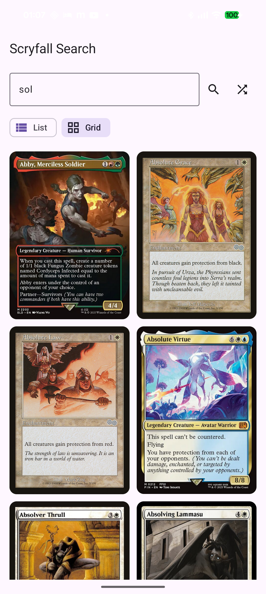

# Android KMP Sample

A Compose Multiplatform Android app demonstrating the scryfall-api library.

## Screenshots

<p align="center">
  
  
  
</p>

## Features

- **Card Search** - Full-text search using Scryfall syntax
- **Random Cards** - Fetch random Magic cards
- **Dual View Modes** - Toggle between list and grid views
- **Image Loading** - Card images with Coil 3
- **Material Design 3** - Modern Android UI

## Running

```bash
cd samples/android-kmp
./gradlew installDebug
adb shell am start -n devmugi.sample.mobilekmp/.MainActivity
```

Or open in Android Studio and run on a connected device/emulator.

## Project Structure

```
android-kmp/
├── build.gradle.kts
├── src/
│   └── androidMain/
│       └── kotlin/.../MainActivity.kt
└── settings.gradle.kts
```

## Dependencies

This sample depends on:
- [sample-shared](../sample-shared/) - Shared UI components via composite build
- scryfall-api - The main library

## Related

- [iOS Sample](../ios-kmp/) - Same app for iOS
- [Browser Sample](../browser-vite/) - Web version with Vite
- [Main README](../../README.md) - Full library documentation
