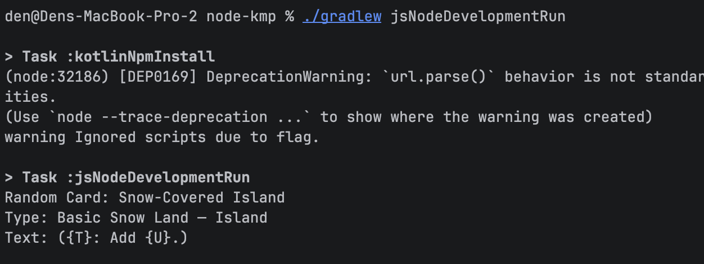

# Node.js KMP Sample

A minimal Node.js console app using Kotlin/JS to demonstrate the scryfall-api library.

## Screenshot



## Features

- **Kotlin/JS** - Uses Kotlin compiled to JavaScript
- **Coroutines** - Async API calls with kotlinx.coroutines
- **Console Output** - Prints random card details

## Running

```bash
cd samples/node-kmp
./gradlew jsNodeRun
```

## Expected Output

```
Random Card: Lightning Bolt
Type: Instant
Text: Lightning Bolt deals 3 damage to any target.
```

## Code Overview

```kotlin
// src/jsMain/kotlin/Main.kt
import devmugi.mtgcards.scryfall.api.CardsApi
import kotlinx.coroutines.MainScope
import kotlinx.coroutines.launch

fun main() {
    val api = CardsApi()
    MainScope().launch {
        val card = api.random()
        println("Random Card: ${card.name}")
        println("Type: ${card.typeLine}")
        println("Text: ${card.oracleText ?: "No text"}")
    }
}
```

## Project Structure

```
node-kmp/
├── build.gradle.kts
├── src/
│   └── jsMain/
│       └── kotlin/Main.kt
└── settings.gradle.kts
```

## Related

- [Node.js JavaScript Sample](../node-npm-js/) - Pure JavaScript without Kotlin
- [Node.js TypeScript Sample](../node-npm-ts/) - TypeScript with full types
- [Browser Sample](../browser-vite/) - Web browser with Vite
- [Main README](../../README.md) - Full library documentation
