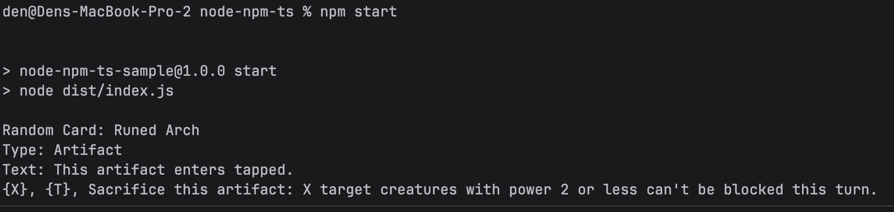

# Node.js TypeScript Sample

A minimal **pure TypeScript** sample demonstrating how to use the `@devmugi/scryfall-api` npm package with full type safety.

## Screenshot



> **Note:** This sample requires the `@devmugi/scryfall-api` package to be published to npm.
> For Kotlin/JS usage without npm publishing, see the [node-kmp](../node-kmp/) sample.

## Prerequisites

- Node.js 18+ (for native ESM support)
- `@devmugi/scryfall-api` published to npm

## Setup

Install dependencies:
```bash
cd scryfall-api/samples/node-npm-ts
npm install
```

## Building

```bash
npm run build
```

This compiles TypeScript to JavaScript in the `dist/` directory.

## Running

```bash
npm start
```

## Expected Output

```
Random Card: Lightning Bolt
Type: Instant
Text: Lightning Bolt deals 3 damage to any target.
```

## Code Overview

```typescript
import { CardsApiJs } from '@devmugi/scryfall-api';

const api = new CardsApiJs();

async function main(): Promise<void> {
    const card = await api.random(null);
    console.log(`Random Card: ${card.name}`);
    console.log(`Type: ${card.typeLine}`);
    console.log(`Text: ${card.oracleText ?? 'No text'}`);
}

main().catch(console.error);
```

## Type Safety

The scryfall-api package includes generated TypeScript declarations (`.d.ts` files), providing:

- **IDE autocompletion** for all API methods and card properties
- **Type checking** at compile time
- **IntelliSense** documentation from KDoc comments

## Key Points

- Uses **ESM** (`"type": "module"` in package.json)
- TypeScript compiles to `dist/` directory
- `CardsApiJs` returns **Promises** (use `async/await`)
- Card properties are fully typed (`name: string`, `typeLine: string`, etc.)
- Use `??` (nullish coalescing) for optional properties

## Related

- [JavaScript Sample](../node-npm-js/) - Same functionality without TypeScript
- [Kotlin/JS Sample](../node-kmp/) - Uses Kotlin/JS directly
- [ADR-007](../../docs/adr/007-npm-samples.md) - Architecture decisions
